# Exhibition Panels

## Panel 1: What is time, then?

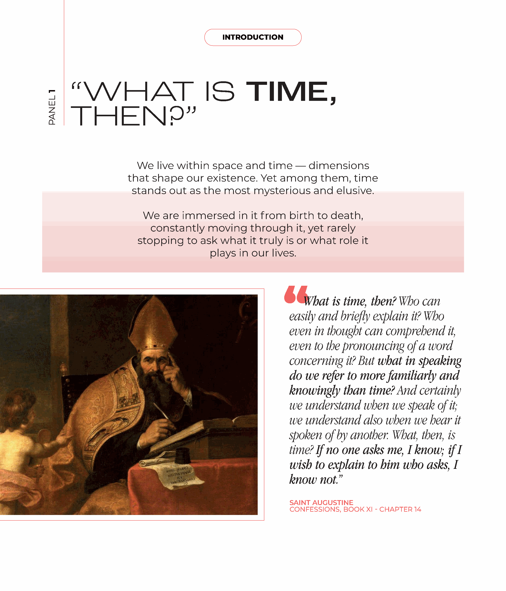

The theme of the New York Encounter this year invites us to look at our need for a place where our humanity is welcomed and nurtured in its truth. We had the desire to look at time, one of the fundamental dimensions of our human experience. We want to explore it, to be able to discover what it is and be helped to recognize where it is approached according to its real nature.

We live within space and time— dimensions that shape our existence. Yet among them, time stands out as the most mysterious and elusive. We are immersed in it from birth to death, constantly moving through it, yet rarely stopping to ask what it truly is or what role it plays in our lives.

Saint Augustine (in the 4th century) expresses this in a very clear way: "What is time, then? Who can easily and briefly explain it? Who even in thought can comprehend it, even to the pronouncing of a word concerning it? But what in speaking do we refer to more familiarly and knowingly than time? And certainly we understand when we speak of it; we understand also when we hear it spoken of by another. What, then, is time? If no one asks me, I know; if I wish to explain to him who asks, I know not."

---

## Panel 2: What is time, then?

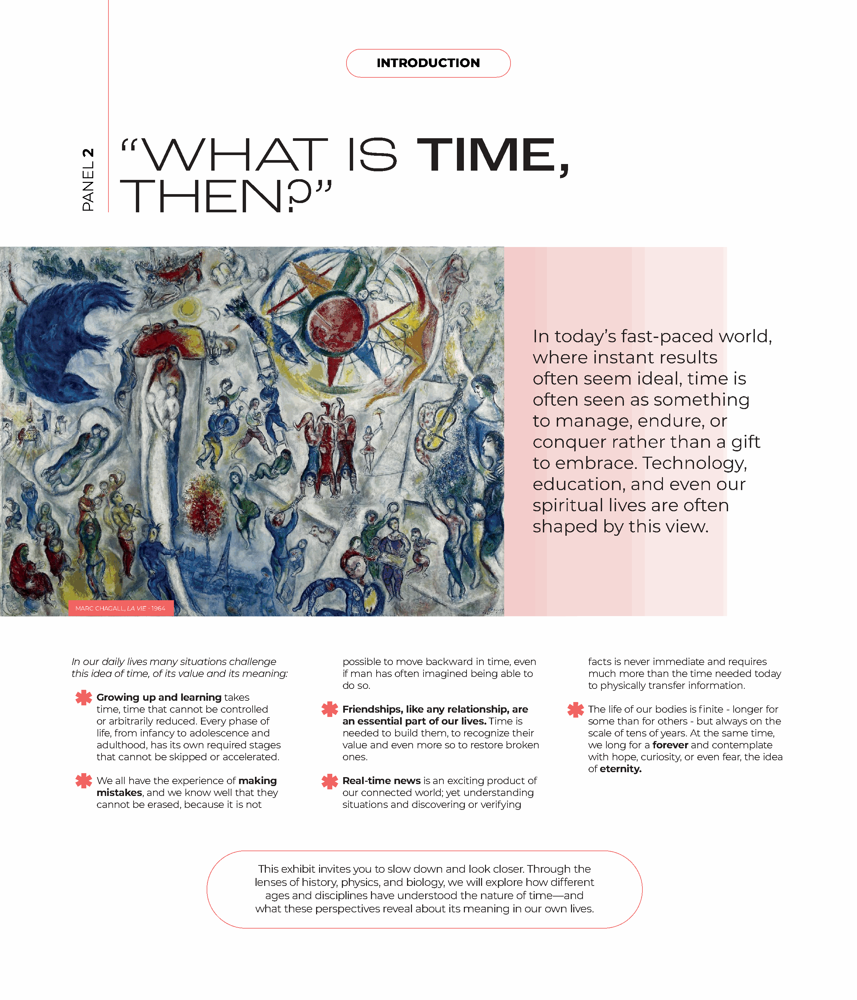

It is difficult for us to explain what time is, yet in the way we approach many life situations we have unspoken yet strong expectations about time, its role and its value. In today's fast-paced world, where instant results often seem ideal, time is often seen as something to manage, endure, or conquer rather than a gift to embrace.

We can all think of moments in our life that have challenged this idea of time as a purely incidental condition that we should be able to bend to the idea we have of it: when we have to face our own mistakes or the mistakes of others close to us; the experience of learning where understanding and knowing require more time than we expect; real-time news where understanding situations requires much more than the time needed to physically transfer information; we desire eternity thinking we should preserve youth forever, yet our bodies age with the passing of time.

In general we often move under the impression that waiting is a waste. Let's pose for a moment and explore how different ages and disciplines have understood the nature of time—and what these perspectives reveal about its meaning in our own lives.

---

## Panel 3: The Experience of Time

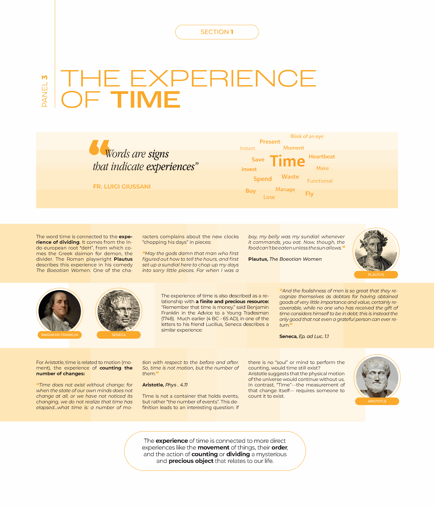

How did we discover time? We want to understand what experience the word "time" is connected to. Here we list three different experiences the word time is connected to:

**The experience of dividing:** The word "time" derives from the root "deH" or "Tem" (to cut). We cannot eat our meal when we want anymore due to time's divisions.

**The experience of dealing with a precious and finite resource:** Benjamin Franklin famously says "time is money" and the verbs we use for time: spend, invest, save, waste... apply as well to money. More deeply Seneca describes how time is an invaluable gift that cannot be repaid or recovered like other debts.

**Connection to motion (moment):** Aristoteles tries to define time connecting it to the experience of motion. Time is not the actual movement but the number of movements "the number of changes" that we can count. But if we need to count to discover time, what if there is nobody counting? Would there still be time?

---

## Panel 4: TIME AND THE COSMOS

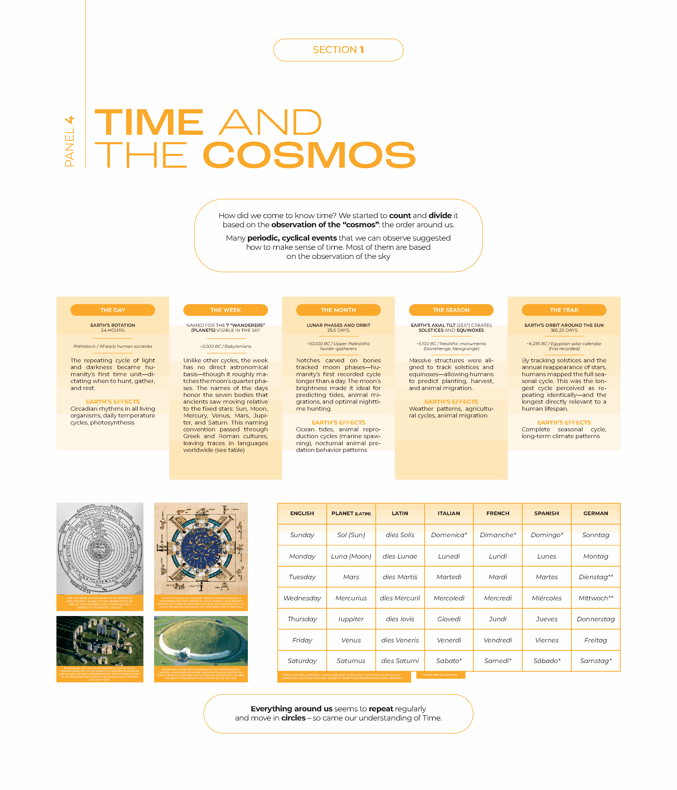

How did we come to know time? We started to count and divide it based on the observation of the "cosmos": the order around us. Many periodic, cyclical events that we can observe suggested how to make sense of time. Most of them are based on the observation of the sky:

- The Day, looking at the sun raising and setting
- The week looking at the 7 visible wanderers (planets) in the sky
- The month, based on the observation of the lunar phases
- The Seasons, based on the observation of the sun's position in the sky
- The year, based on the observation of the fixed stars

Our ancestors spent a lot of time looking at the sky and their experience was that everything rotated and repeated around them. So was their image of the cosmos—the universe was mostly circular, and also their idea of time.

---

## Panel 5: From the Circle to the arrow of time

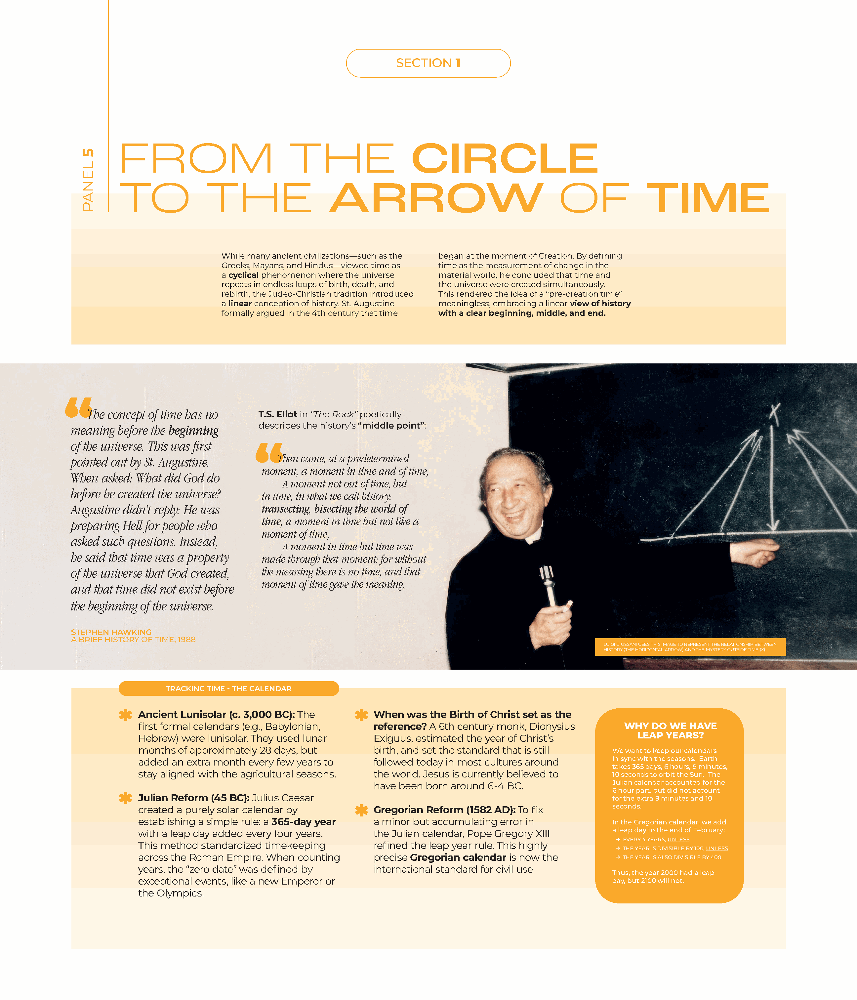

Many ancient civilizations—such as the Greeks, Mayans, and Hindus—viewed time as a cyclical phenomenon where the universe repeats in endless loops of birth, death, and rebirth. It is the Judeo-Christian tradition that introduced a linear conception of history. St. Augustine was the one that formally argued in the 4th century that also time has a beginning at the moment of Creation.

Stephen Hawking expressed this: "The concept of time has no meaning before the beginning of the universe. This was first pointed out by St. Augustine. When asked: What did God do before he created the universe? Augustine didn't reply: He was preparing Hell for people who asked such questions. Instead, he said that time was a property of the universe that God created, and that time did not exist before the beginning of the universe."

Time has a beginning, a middle point and possibly an end. Today most of the world uses the birth of Christ as the year zero. We also see Luigi Giussani's representation of the arrow of time, the history indicated by the horizontal line, and the religions as diagonal arrows attempting to reach the mystery outside time.

---

## Panel 6: The Pendulum

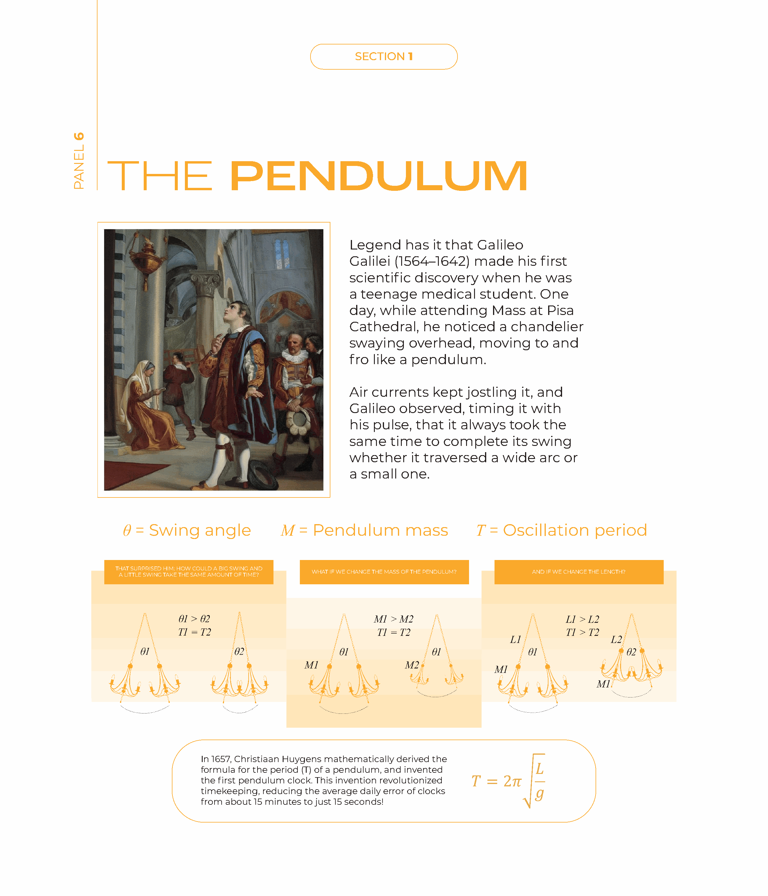

Legend has it that Galileo Galilei (1564–1642) made his first scientific discovery when he was a teenage medical student. While attending Mass at Pisa Cathedral, he noticed a chandelier swaying overhead. He observed, timing it with his pulse, that it always took the same time to complete its swing whether it traversed a wide arc or a small one. This surprised him: How could a big swing and a little swing take the same amount of time?

Galileo discovered a way to keep track and count time that was precise and controllable. In 1657, Christiaan Huygens mathematically derived the formula for the period of a pendulum and invented the first pendulum clock. This invention revolutionized timekeeping, reducing the average daily error of clocks from about 15 minutes to just 15 seconds!

To make a clock you just need to count the ticks and keep track of the number. The pendulum clock is essentially a system of gears that count the ticks and move the hands of the clock.

---

## Panel 7: THE HISTORY OF TIME MEASUREMENT

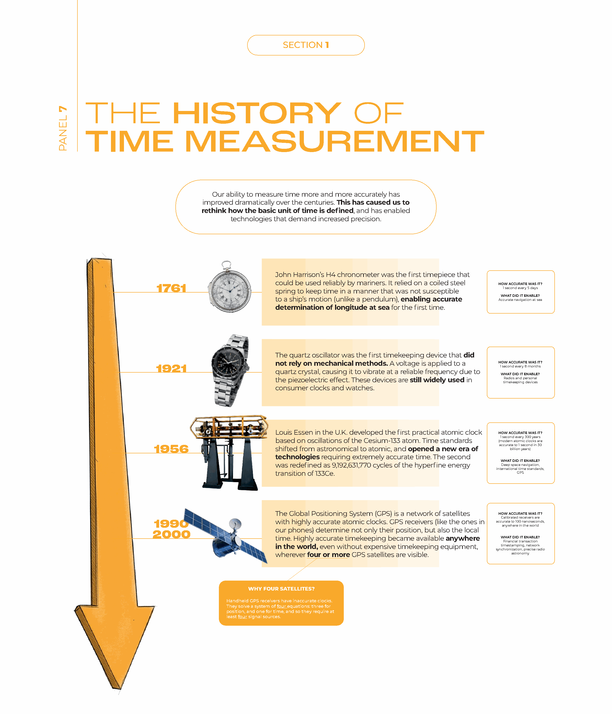

From that moment our ability to measure time increasingly accurately has improved dramatically over the centuries. This progression includes:

**1761:** John Harrison's H4 chronometer was the first timepiece that could be used reliably by mariners. It relied on a coiled steel spring to keep time in a manner not susceptible to a ship's motion, enabling accurate determination of longitude at sea for the first time.

**1921:** The quartz oscillator was the first timekeeping device that did not rely on mechanical methods. A voltage is applied to a quartz crystal, causing it to vibrate at a reliable frequency due to the piezoelectric effect.

**1956:** Louis Essen in the U.K. developed the first practical atomic clock based on oscillations of the Cesium-133 atom. Time standards shifted from astronomical to atomic. The second was redefined as 9,192,631,770 cycles of the hyperfine energy transition of 133Ce.

Like Aristoteles suggested, to define time we need to count the number of some periodic events. The atomic clock is the core technology for GPS satellites that send signals at very constant intervals of time.

---

## Panel 8: THE DIRECTION OF TIME

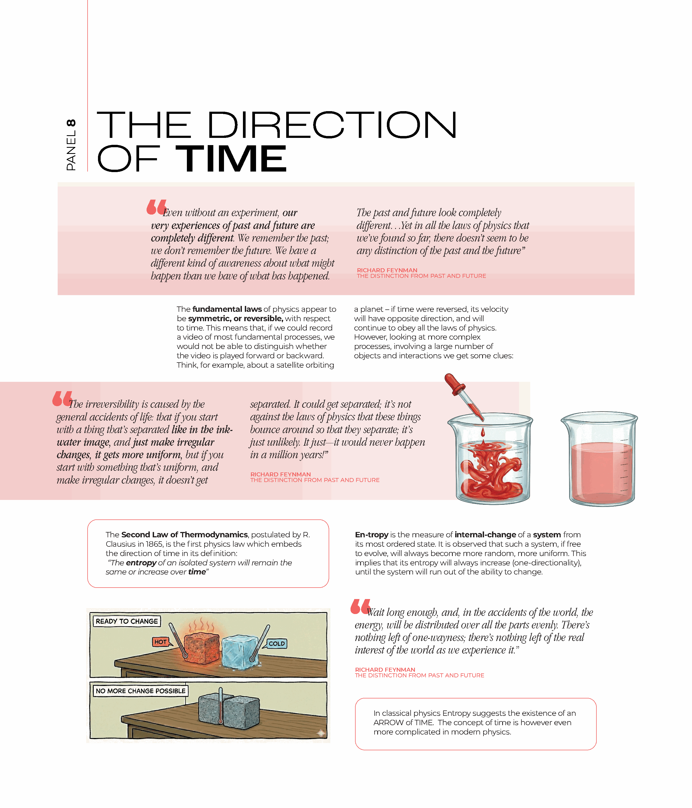

What distinguishes the past from the future? Richard Feynman noted: "Even without an experiment, our very experiences of past and future are completely different. We remember the past… Yet in all the laws of physics that we've found so far, there doesn't seem to be any distinction between the past and the future…"

The fundamental laws of physics are symmetric with respect to time. Only looking at more complex processes, involving many objects and interactions we get clues about the arrow of time.

The Second Law of Thermodynamics, postulated by R. Clausius in 1865, is the first physics law which embeds the direction of time in its definition: "The entropy of an isolated system will remain the same or increase over time."

Imagine two blocks at different temperatures. As soon as they make contact, they start to exchange energy from hot to cold. Eventually they reach the same temperature, the state of maximum entropy. Our experience tells us that this process cannot reverse itself—we never see a cold block spontaneously become hot while another becomes cold. Time has a direction.

---

## Panel 9: TIME at the EXTREMES: SPECIAL RELATIVITY

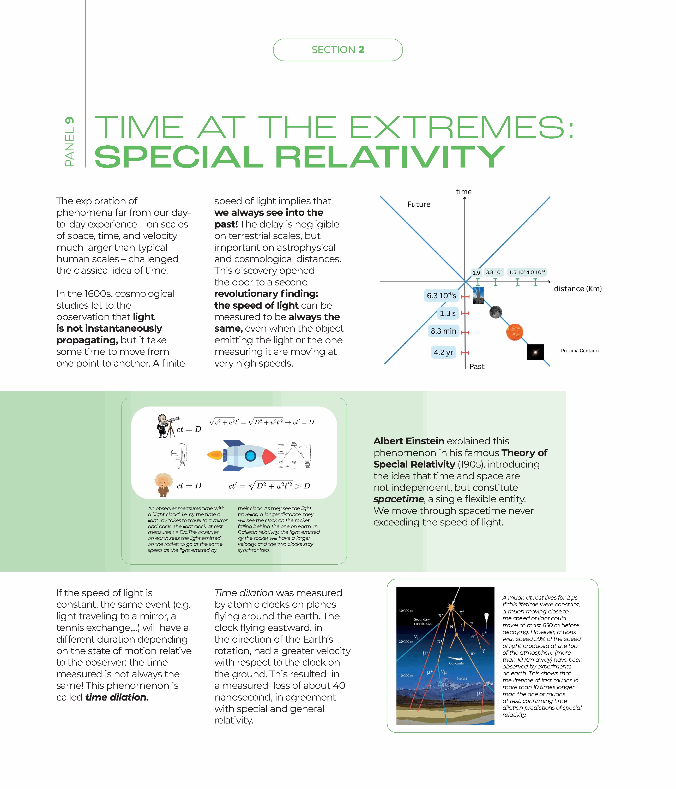

The exploration of phenomena far from our day-to-day experience challenged the classical idea of time. A finite speed of light (300,000 km/s) implies that we always see into the past! The delay is negligible on terrestrial scales, but important on astrophysical and cosmological distances.

Einstein discovered that the speed of light is always the same, even when the object emitting the light is moving. This is counterintuitive but true. Albert Einstein explained this phenomenon in his famous Theory of Special Relativity (1905), introducing the idea that time and space are not independent, but constitute spacetime, a single flexible entity.

A crucial consequence: if the speed of light is constant, the same event will have a different duration depending on the state of motion relative to the observer—time dilation. An observer moving relative to a clock will measure it ticking more slowly than an observer at rest with the clock.

Time dilation has been measured in atomic clocks on planes flying around the earth and is observed daily for subatomic particles like muons moving close to the speed of light.

---

## Panel 10: TIME and GRAVITY: GENERAL RELATIVITY

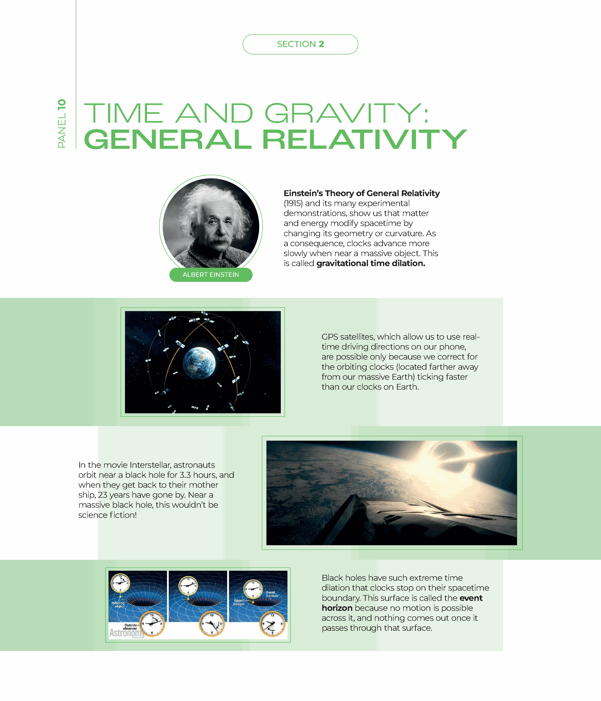

With general relativity, we take a further step. Space and time are not fixed, but they are modified by energy and matter. Time is slower closer to a massive object. Gravitational time dilation needs to be accounted for for GPS to work, and its effect is dramatic close to very massive objects such as black holes.

Albert Einstein's theory says that mass tells space how to curve and space tells mass how to move. Beyond predicting exotic phenomena such as black holes, another consequence of Einstein's theory is that if massive objects are orbiting around one another they create gravitational waves—ripples in the fabric of spacetime that travel at the speed of light and carry information about the system that created them.

---

## Panel 11: COSMIC TIMEKEEPING: RADIO PULSARS

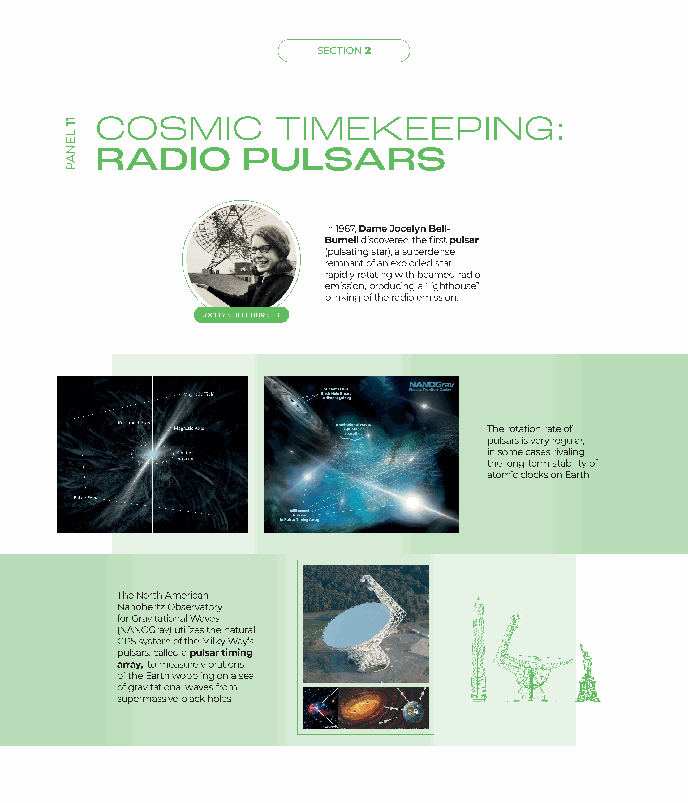

We have seen how clocks work. Our galaxy is provided with its own set of clocks—radio pulsars. Their regularity is such that in some cases they are more stable than atomic clocks. These precise clocks allow us to look for modifications of spacetime induced by gravitational waves.

Pulsars were first discovered by Dame Jocelyn Bell Burnell in 1967. Pulsars are very dense collapsed stars that spin very quickly. Just as a figure skater spins more quickly when she pulls in her arms, when a big star collapses to form a neutron star, the rotation speeds up until some neutron stars spin as fast as a blender. 

Neutron stars also have very strong magnetic fields, not lined up with the star's rotation, which is why we get a "lighthouse" effect. Particles are accelerated along the magnetic field and create beams of radio light—these were first discovered by Bell as radio pulses.

---

## Panel 12: THE TIME of the COSMOS

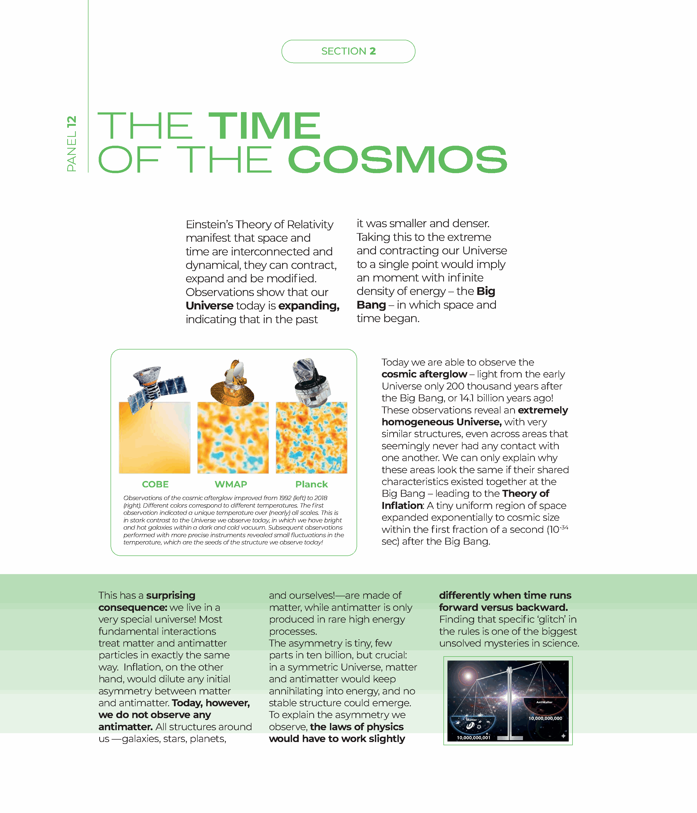

We have seen that Einstein's theories manifest that space and time are interconnected and dynamical. Hubble's observations in the 1930s showed that our Universe is not fixed, but is expanding. If the Universe is now expanding, in the past it was smaller and denser. Taking this to the extreme would imply a moment with infinite density of energy: the Big Bang.

Today we are able to observe the cosmic afterglow of this explosion—the Cosmic Microwave Background (CMB), light from the early Universe only 400 thousand years after the Big Bang, or 14.1 billion years ago! These observations reveal an extremely homogeneous Universe, which led to the Theory of Inflation: A tiny uniform region of space expanded exponentially to cosmic size within the first fraction of a second after the Big Bang.

Inflation explains why the universe looks the same everywhere. Most fundamental interactions treat matter and antimatter identically, yet today we observe no antimatter—all structures around us are made of matter. Finding the explanation for this asymmetry is one of the biggest unsolved mysteries in science.

---

## Panel 13: THE TIME of the COSMOS

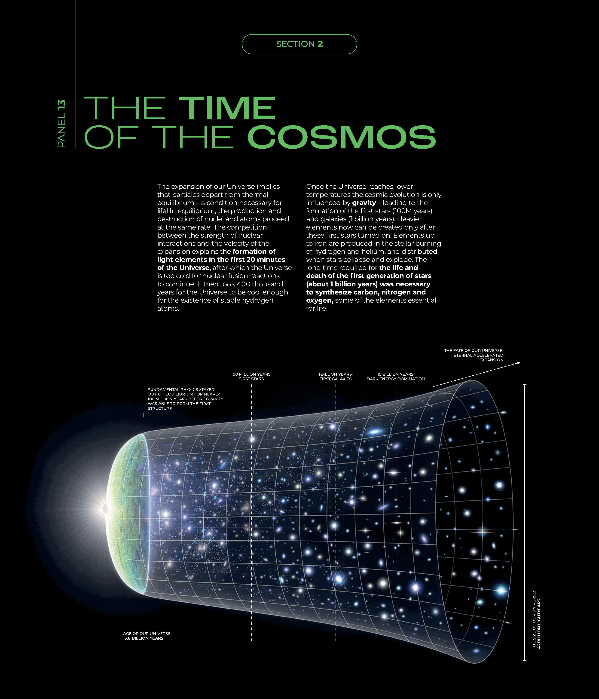

The expansion of our Universe implies that particles depart from thermal equilibrium—a condition necessary for life! The formation of light elements took place in the first 20 minutes of the Universe. At this time, the Universe mostly contains nuclei of hydrogen and helium.

It then took 400 thousand years for the Universe to be cool enough for the existence of stable hydrogen atoms. This is about the time that light and matter decouple, the time of the CMB. Once the Universe reaches lower temperatures the cosmic evolution is only influenced by gravity—leading to the formation of the first stars (100 million years) and galaxies (1 billion years).

Heavier elements can be created only after the first stars turned on. The long time required for the life and death of the first generation of stars (about 1 billion years) was necessary to synthesize carbon, nitrogen and oxygen, some of the elements essential for life.

---

## Panel 14: BIOLOGICAL EVOLUTION: TIME SHAPES LIFE

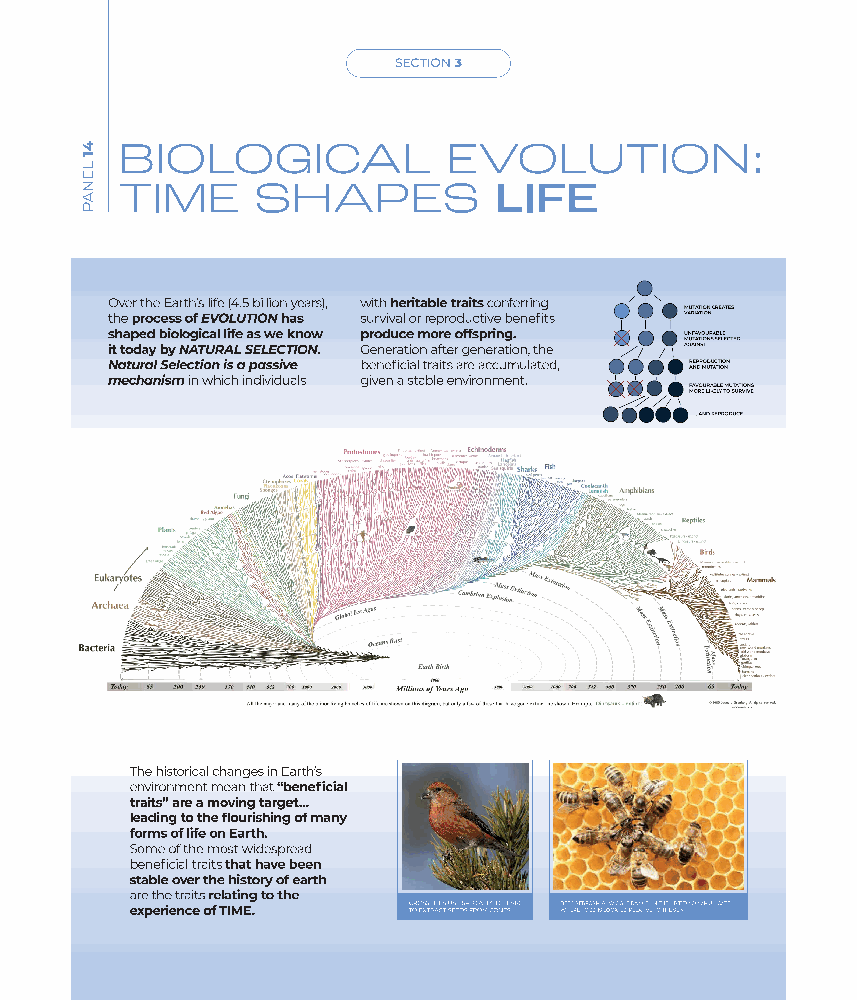

From the evolution of the Universe we move to the evolution of life. The evolution of life on Earth was also a long process, which started about 4 billion years ago. The process that shaped life as we know it is called Natural Selection, a mechanism in which individuals with heritable traits conferring survival or reproductive benefits produce more offspring.

The environment plays a very important role in favoring some traits over others: traits that can be beneficial in a desert, such as the ability to store water, are not beneficial in other environments. What traits were "beneficial" throughout the evolution of life was a moving target. Innumerable forms of life flourished and perished in the past 4 billion years—humans are just at the very tip of this huge family tree.

At the core of this section: life was shaped THROUGH Time, and also that life was shaped BY Time—by the experience of Time we have on Earth. Individuals who could better deal with our experience of time were more likely to survive and spread.

---

## Panel 15: RHYTHMS IN NATURE

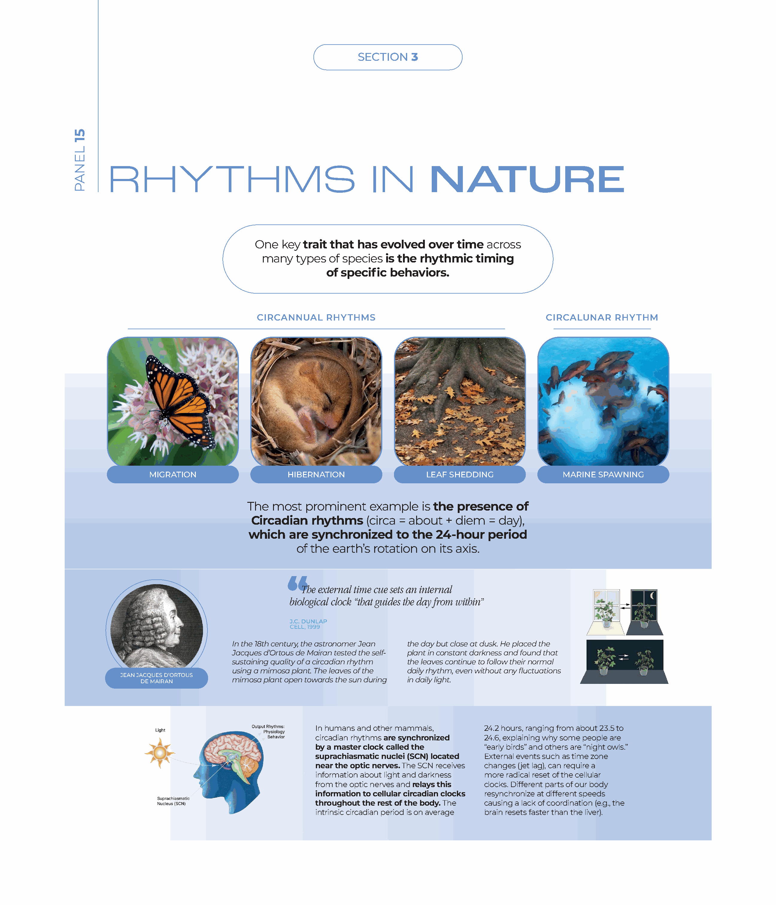

The most evident beneficial traits are the ways in which organisms "synchronize" to nature's cycles: the seasons cycle every year, the moon cycle approximately every month, and obviously the daily cycle of day and night, light and dark.

Examples of "circannual rhythms" (rhythms with a period of approximately one year) are animal migrations, hibernation during the cold season, and leaf shedding. Examples of "circalunar rhythms" are rare in nature but some exist: some fish synchronize their reproductive cycles with lunar cycles.

The rhythms most known and evident in our human experience are "circadian rhythms" (from latin "circa" = approximately, and "diem" = day), which are those rhythms synchronized to the 24-hour period of the Earth's rotation. The most fascinating aspect is that they are not determined by external cues such as light and dark, but are set by an internal clock. Jean Jacques D'Ortous De Mairan verified that mimosa plants open their leaves during the day and close them during the night even when placed in constant darkness.

Circadian rhythms in humans are synchronized by a master clock in our brain (the suprachiasmatic nuclei) which receives information about light and darkness and resets the internal clocks present in every single cell of our body. These rhythms are written in our DNA: they are heritable traits that proved beneficial and spread generation after generation.

---

## Panel 16: THE TIMES OF THE BRAIN

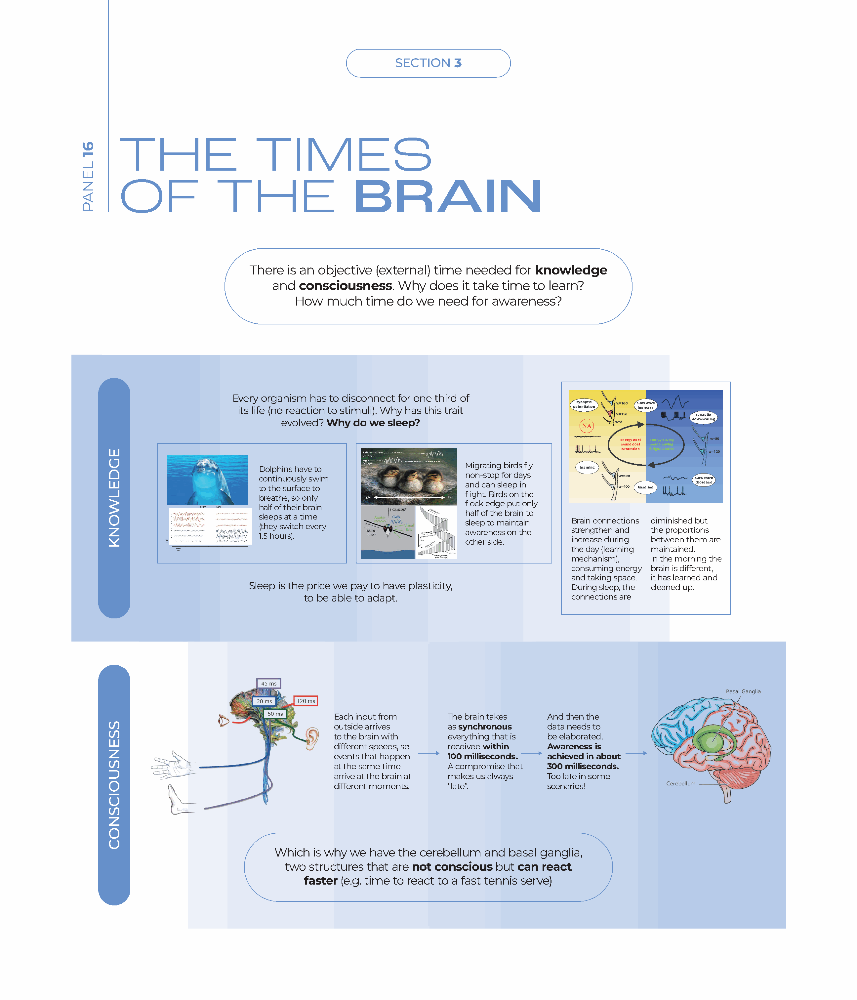

We turn now to the experience of time our brain has. A characteristic shared by every organism with at least two or three neurons is the need to sleep approximately one third of its life. Why would such a trait evolve? Interesting examples: dolphins put only half of their brain to sleep at a time to surface for breath; migrating birds can sleep while flying with just half of their brain asleep to watch for predators.

While we sleep our brain cleans itself. During the day, brain connections strengthen and increase (we store data, we learn). This process consumes energy and takes physical space. During sleep, these connections diminish, but the proportions between them are maintained. In the morning our brain is different, it has learned and cleaned up. Sleep is the price we pay for plasticity.

The second experience our brain has of time is the delay between an external stimulus and our consciousness and the need to understand event synchrony: each input from outside arrives at the brain at slightly different times. Our brain evolved to consider synchronous everything received within 100 milliseconds. Once the data is processed, approximately 300 milliseconds have gone by. Therefore, we are always late!

---

## Panel 17: MEMORY: WHERE TIME'S ARROW IS BENT

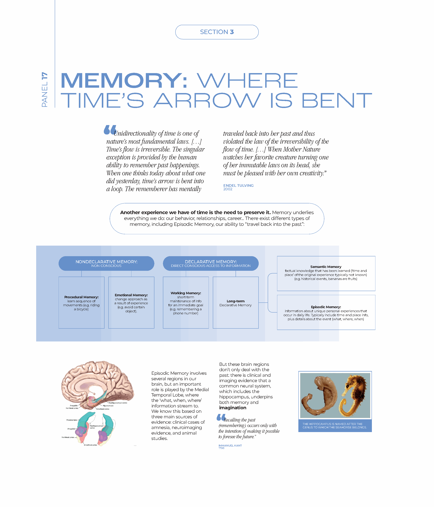

This panel looks at our brain's ability to retain information: Memory. In physics, we discussed how time's arrow is irreversible. Yet our brain has the remarkable ability to remember past happenings. When one thinks today about what one did yesterday, time's arrow is bent into a loop. The rememberer has mentally traveled back into her past and thus violated the law of the irreversibility of the flow of time.

Memory underlies everything we do: our behavior, relationships, career. What is described as "mental time travel" is our ability to remember specific events from our past experience—Episodic Memory. It includes information about the what, where, and when of an event.

There exist different types of memory: "nondeclarative memory" (non-conscious memory like muscle memory), and "declarative memory" which includes episodic memory, working memory (short term memory), and semantic memory (memory of factual knowledge).

Episodic memory involves several regions of our brain, but an important role is played by the Medial Temporal Lobe and specifically the Hippocampus. Interestingly, the regions involved in episodic memory are the same that activate when we imagine something that could happen in the future. Our brain bends time's arrow.

---

## Panel 18: So, What is Time?

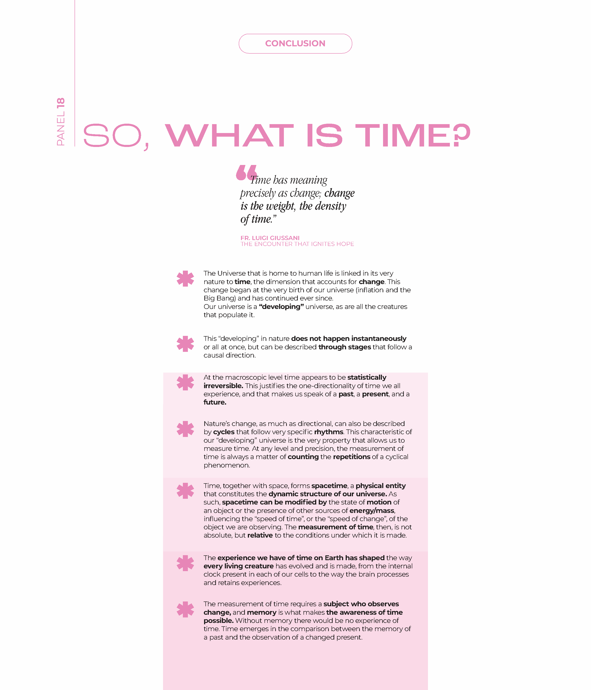

We are at the end of our exploration of the nature of time. We want to underline that time is the dimension that accounts for change. Our universe is a "developing" universe, as are all the creatures that populate it. Luigi Giussani said: "…time has meaning precisely as change; change is the weight, the density of time."

The Universe that is home to human life is linked in its very nature to time, the dimension that accounts for change. This change began at the very birth of our universe (inflation and the Big Bang) and has continued ever since. This "developing" in nature does not happen instantaneously or all at once, but can be described through stages that follow a causal direction.

At the macroscopic level time appears to be statistically irreversible. Nature's change, as much as directional, can also be described by cycles that follow very specific rhythms. This characteristic of our "developing" universe is the very property that allows us to measure time.

Time, together with space, forms spacetime, a physical entity modified by the state of motion of an object or the presence of energy/mass. The measurement of time is not absolute, but relative to the conditions under which it is made.

---

## Panel 19: What is time for?

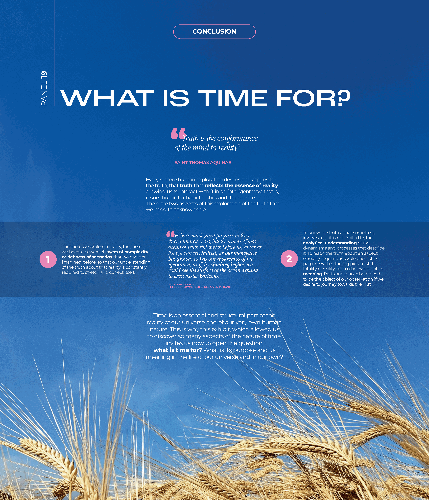

We conclude this exploration on the nature of time offering a couple of last comments: Every sincere human exploration desires and aspires to the truth, that truth that reflects the essence of reality allowing us to interact with it in an intelligent way, respectful of its characteristics and its purpose.

When exploring the truth about time, we need to consider that the more we explore a reality, the more we become aware of layers of complexity and richness of scenarios we had not imagined before, so our understanding must constantly stretch and correct itself.

To know the truth about something involves, but is not limited to, the analytical understanding of its dynamisms and processes. To reach the truth requires an exploration of its purpose within the big picture of the totality of reality—its meaning. We need to observe both parts and the whole if we desire to journey towards the Truth.

This is why this exhibit invites us now to open the question: what is time for? What is its purpose and its meaning in the life of our universe and in our own?

---

## Panel 20: A Question for You

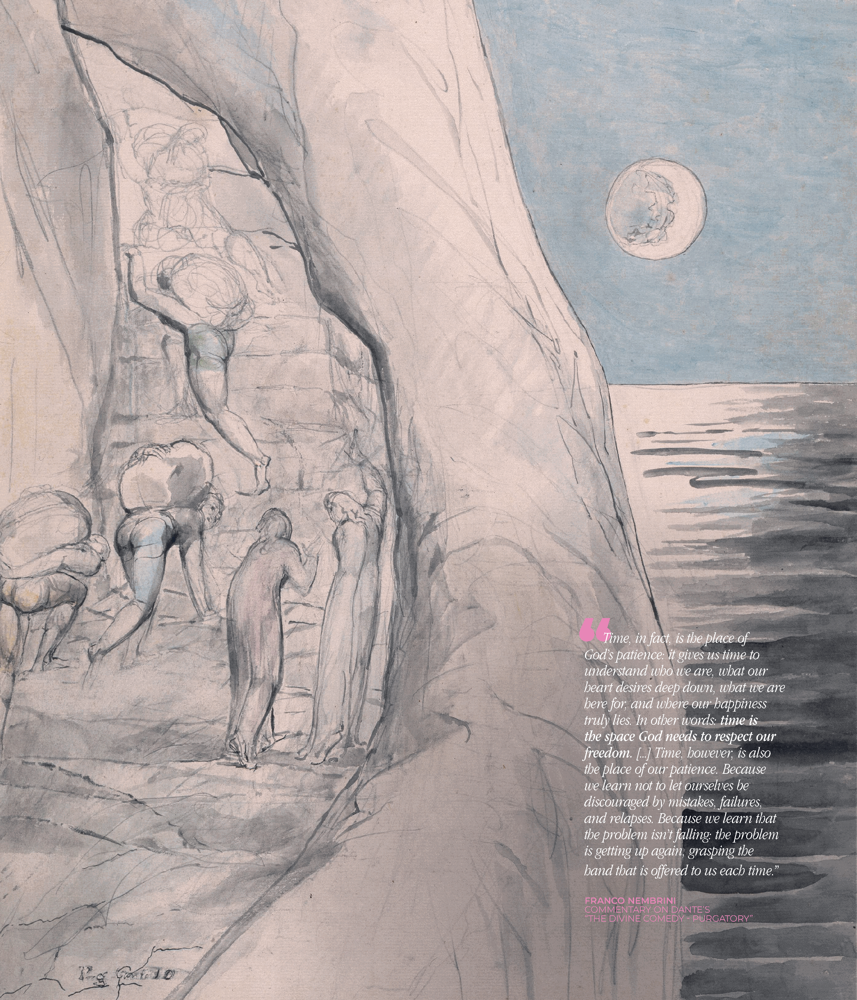

This is a question that we all need to ask and answer for ourselves. We conclude with this quote that proposes an answer through the words of Franco Nembrini, in a comment to Dante's Purgatory:

"Time, in fact, is the place of God's patience: it gives us time to understand who we are, what our heart desires deep down, what we are here for, and where our happiness truly lies. In other words: time is the space God needs to respect our freedom. 

Time, however, is also the place of our patience. Because we learn not to let ourselves be discouraged by mistakes, failures, and relapses. Because we learn that the problem isn't falling: the problem is getting up again, grasping the hand that is offered to us each time."

